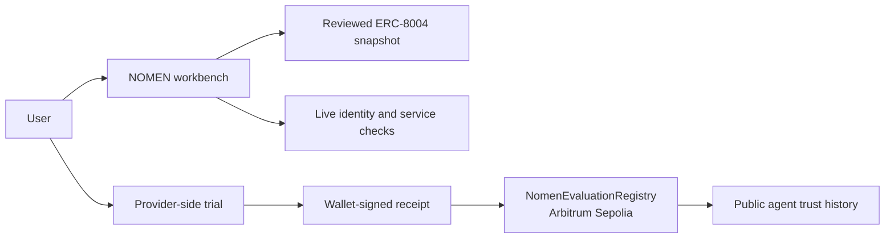

# NOMEN — verifiable AI agent discovery

NOMEN helps users find AI agents for a task, inspect registry evidence and prepare a provider-side trial. The landing page introduces the product; Open app leads to `/workbench`, where English AI search and the manual directory share one page.

User-reviewed trial results can be committed as hash-only, wallet-signed receipts through the same `NomenEvaluationRegistry` interface on each supported agent network. Verified deployments are live on Sepolia, Arbitrum Sepolia and Arc Testnet. The Ethereum deployment slot remains disabled until a funded mainnet deployment is verified.

- Live application: [nomen-beta.vercel.app](https://nomen-beta.vercel.app)
- Arbitrum Sepolia contract: [`0x33D6893fA6015EeecE1d9232A8D0659F42eF669e`](https://sepolia.arbiscan.io/address/0x33D6893fA6015EeecE1d9232A8D0659F42eF669e)
- License: [MIT](LICENSE)

## How it works

1. A user describes the job they need an agent to perform and selects a network.
2. NOMEN searches its reviewed ERC-8004 snapshot and ranks eligible agents against that request.
3. The user inspects current ownership, metadata and public service evidence before running a provider-side trial.
4. The user reviews the result and can publish a hash-only, wallet-signed receipt to the selected network.
5. Anyone can independently read the receipt, its reviewer, agent identity and outcome from the chain without exposing the trial note.

NOMEN does not execute tasks, hold user funds or certify providers. It makes discovery evidence and user-submitted trial receipts easier to inspect.



## Live evaluation deployments

| Network | Chain ID | Registry | Verified smoke receipt |
| --- | ---: | --- | --- |
| Sepolia | 11155111 | [`0xEd3d…6605`](https://sepolia.etherscan.io/address/0xEd3dFB7c561CEf35F51e9613f8E89dD821e16605) | [transaction](https://sepolia.etherscan.io/tx/0x6bf781f7dff310a7d691ddf051177b290be5dbd2711cec1daa5b373f6f64c2a1) |
| Arbitrum Sepolia | 421614 | [`0x33D6…669e`](https://sepolia.arbiscan.io/address/0x33D6893fA6015EeecE1d9232A8D0659F42eF669e) | [transaction](https://sepolia.arbiscan.io/tx/0x363f1eada0965113596960b3551d4678d38df76bac6776ae89be436b78e2307c) |
| Arc Testnet | 5042002 | [`0x32F2…0878`](https://testnet.arcscan.app/address/0x32F26E5807af0C9e8ac71F7F4351164e2Eb60878) | [transaction](https://testnet.arcscan.app/tx/0x57c9048d437b6a608f4c9a4a152e3f14cec7df0edcd836bfa2245c95113ff923) |

All three deployments use the same Solidity source and are pinned to the ERC-8004 Identity Registry on their chain. A smoke receipt confirms deployment and read-back behavior; it is not an audit or evidence that a provider completed a real task. Full deployment hashes and checks are recorded in [`inceleme/evaluation-registry-deployments.json`](inceleme/evaluation-registry-deployments.json).

## Arbitrum Open House Singapore 2026

NOMEN existed before the buildathon. The public pre-buildathon baseline is preserved in the annotated tag [`arbitrum-open-house-baseline-2026-09-12`](https://github.com/Foreveranka/nomen/tree/arbitrum-open-house-baseline-2026-09-12). Work attributed to the buildathon will begin after the official event start and will be documented through normal commits. The Arbitrum scope and its timing are described in [`inceleme/arbitrum-open-house-feature-plan.md`](inceleme/arbitrum-open-house-feature-plan.md).

The Arbitrum Sepolia integration is already functional in the baseline: the catalog includes eligible ERC-8004 identities, live trials read current identity data, and users can record review receipts on chain. A public, independently readable trust history was added on September 12 as a pre-event extension and will not be presented as buildathon-period work.

## Current status — 12 September 2026

- DeepSeek discovery, directory filters, agent records, live checks, trial prompt preparation, browser-local shortlist, bulk CSV export, snapshot API and docs are implemented.
- Published eligible records: Ethereum 3,709; Sepolia 1,421; Arbitrum Sepolia 44; Arc testnet 249. These are snapshot counts, not current registry totals. The Arbitrum Sepolia snapshot covers all 205 registered IDs observed at block 307,933,498 on September 12, 2026. Legacy Ethereum timestamps remain unverified. The 249 listed Arc records were refreshed September 11, 2026, at block 61552064; non-listed Arc records retain legacy observations.
- Sepolia naming is deployed under nomen-demo.eth. A real claim for the NOMEN-owned test agent #10226, runtime bytecode, roles, resolver records, non-transferability and authorization boundaries were verified. Evidence: inceleme/ens-live-evidence.json.
- Graph Studio v0.3.0 is deployed and configured for the replacement registrar. Sepolia and Arc AI matching require fresh Graph data and compare owner/URI against the snapshot block before ranking. DeepSeek receives feedback and change history and cites supplied registry facts. Unavailable or stale Graph evidence withholds candidates on the affected network. Ethereum and Arbitrum Sepolia stay explicitly snapshot-only; Try this agent still reads Arbitrum ownership and metadata live from chain 421614. Arc uses a separate index scoped to the 249 listed IDs, configured through NOMEN_ARC_SUBGRAPH_URL. Check the activity response for current synchronization; deployment alone is not proof of a complete index.
- Optional x402 uses Base Sepolia USDC, not Arc. Local and production resource-server tests verified a 0.001 USDC transfer, HTTP 402/200, invalid-signature rejection and replay rejection (inceleme/x402-production-evidence.json). The free testnet facilitator also produced intermittent transaction failures; those attempts returned 402, not success. The snapshot endpoint stays free.

## Run and verify

```sh
cd site
npm ci
npm run lint
npm run build
npm start
```

```sh
cd kontratlar
forge test
```

```sh
cd subgraph
npm ci
npm run codegen
npm run build
```

```sh
cd tarayici
python3 -m unittest discover -s tests -v
./tazele.sh sepolia 10105
```

The scanner creates an isolated snapshot. Inspect unresolved reads, the manifest, archived documents, dictionary and eligibility differences before exporting with `adim5_dizin.py` and `adim6_api_veri.py`. Run both exporters with all four chains and a reviewed `NOMEN_SCAN_DIR`. A root proves membership, not correctness of offchain classification. Exact replay requires the archived input bytes and matching rule dictionary; legacy archives may be incomplete.

## Job workbench — 11 September 2026

`POST /api/discover` accepts an English request (15–500 characters) and optional chain. Direct DeepSeek (`deepseek-flash`, server-only `DEEPSEEK_API_KEY`) extracts requirements and search concepts, retrieves up to 48 published candidates and ranks up to four. Reasons are capped at 180 characters, source quotes at 300 and unknowns at two items. There is no AI essay. The shared ranking prompt/schema are in `site/lib/discovery-ranking.ts`. Unknown IDs, duplicate selections and non-source quotes are rejected. Invalid structured output is retried once within the shared 45-second deadline. Provider and per-instance throttling may still reject requests; no global budget cap is claimed.

The Try this agent button runs `POST /api/evaluate`. It reads current ownership/metadata and at most three public HTTPS services. The guide labels service documents separately, exposes usable observed links and prepares a local trial template from the original task and a public/synthetic sample. Nothing is sent to the agent automatically. The user runs the task with the provider and reviews its result.

`POST /api/evaluate` accepts `{ "chain": "ethereum", "agentId": 22817, "job": "custom", "request": "Weather forecasts and air quality" }`. Legacy wallet_report, research and payments checklists remain. Custom task fit is unknown to live checks. Decisions are shortlist_for_trial, needs_review or hold; automaticExecutionAllowed is always false.

Browser-local reports expire after 15 minutes and are keyed by task plus agent identity. A user-reported trial review requires fresh, non-held evidence, a usable service URL and a note; a passed result also requires every review checkbox. Where deployed, the wallet can publish the outcome and hashes to the selected agent network without putting the note onchain. It is not an automated certification. Rechecks are manual; no background monitoring exists.

Run `node --experimental-strip-types --test scripts/discovery.test.mjs scripts/evaluation.test.mjs scripts/evaluation-registry.test.mjs scripts/trial.test.mjs scripts/graph-discovery.test.mjs` from `site`. The controlled ten-case English ranking run passed all ten in one run; this small fixed-roster check does not prove general accuracy or task execution. See `inceleme/2026-09-11-concise-discovery.md`, `inceleme/2026-09-11-try-agent.md` and `inceleme/evaluation-registry-deployments.json`.

## APIs

- `GET /api/snapshot?chain=sepolia&agentId=2364`: free published result and provenance.
- `POST /api/toplu`: `{ "chain": "sepolia", "agentIds": [2364, 6815] }`, maximum 2,000 positive safe integers and 64 KiB body.
- `GET /api/activity?agentId=2364`: live Graph activity if configured; otherwise 503.
- `GET /api/evaluations?chain=arbitrum&agentId=205`: live Arbitrum Sepolia trial-receipt history and wallet-level aggregate counts.
- `/api/dogrula`: optional x402 demonstration when `NOMEN_PAY_TO` is configured; otherwise free.

`not_scanned` and `rpc_error` are unknown states, not evidence that an agent does not exist. A failed HTTP fetch means unreachable at observation time, not permanently dead.

## Naming security model

The administrator publishes roots and controls revocation, reinstatement and renewal. Claims require current ownership, Merkle eligibility and no suspension. `isNamed` also requires the current registration generation, unexpired registration and matching checked root. Publishing a new root invalidates previous endorsements until revalidated.

`NomenResolver` permits only registrar writes, scopes records by registration token and hides records after expiry, ownership mismatch, suspension or root mismatch. Owner transfer and resolver-edit roles are withheld. Local tests use an ENS registry mock; the September 11 deployment also passed live Sepolia verification.

Do not reuse the old deployer credential. Configure a new operator wallet externally; never commit keys. The deployment script rejects the known compromised address and non-Sepolia execution. The old parent was not migrated. The new operator owns nomen-demo.eth on Sepolia. Set public claim variables only after verifying the replacement deployment, roles, text records, proof and receipt. See `site/.env.example`.

## Submission

See `inceleme/submission-draft.md` and `inceleme/demo-script.md`. These are drafts, not a submitted entry. The owner must confirm From Scratch versus Continuity, disclose pre-event work and AI assistance, record a human-narrated demo, and publish a reviewed source repository. No fabricated historical commits are supplied.

## September 11 test record addition

The original September 9 Sepolia snapshot is retained. The separately checked, NOMEN-owned demo record #10226 was added using `tarayici/add_demo_record.py`. It is visibly tagged as a test; IDs 10,106–10,225 remain unscanned. The addition evidence and root transition are public at `/veri/sepolia/demo-evidence.json`. Never rebuild the release from an older unreviewed local scanner directory.

### Graph-backed AI matching

`site/lib/graph-discovery.ts` gates Sepolia and Arc candidates using live Graph queries, not the activity panel. A fresh current block is pinned, and each candidate is compared with its own published snapshot block (including later single-record additions). Ownership/URI mismatches and unknown history withhold candidates before AI ranking. Immutable identity checkpoints preserve historical owner/URI values even when the provider prunes mutable entity versions; queries select the last event at or before the snapshot block, read at the same pinned current block. The unchanged URI comparison does not verify current HTTP contents.

The model receives only surviving candidates, with indexed feedback, distinct-wallet and change counters. Its `registrySignals` must reference server-supplied facts; unsupported citations are rejected. Task capability remains the primary matching criterion. Feedback, including withdrawn records, is not proof of completed work or independent users.

Run `node --test scripts/graph-discovery.test.mjs` in `site` for stale data, ownership/URI changes, pruned history, provider failures, mixed-network scope and fabricated citations. Run `node scripts/test-graph.mjs` for the real Sepolia claim. With the site running, run `NOMEN_TEST_BASE_URL=https://nomen-beta.vercel.app node scripts/test-graph-ai.mjs` for two real DeepSeek searches; every result is checked against independent Graph queries, including its immutable identity baseline. `/docs/evaluate` describes the user-facing flow.
